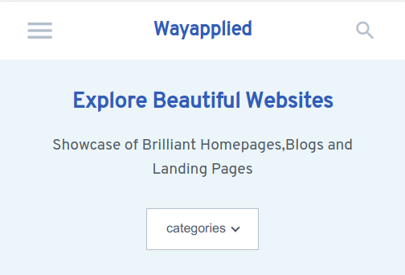

# Wayapplied (Under Development)

> Wayapplied is web application that showcase beautiful website.

Wayapplied maintain a database of beautiful websites build by people and brands all around the world and showcase them to users



## Development setup

OS X & Linux:

```sh
npm install
cd api && pipenv install
api> touch .env & .flaskenv
```

Import Database into System

```sh
mysql -u username -p database_name < wayapplied.sql
```

Copy-Paste this code to your .env file

```sh
MYSQL_HOST = 'Your Database Host'
MYSQL_USER = 'Your Username'
MYSQL_PASSWORD = 'Your Database Password'
MYSQL_DB = 'Database Name'
MYSQL_CURSORCLASS = 'DictCursor'
SECRET_KEY = 'Your Secret Key'
```

Copy-Paste this code to your .flaskenv file

```sh
FLASK_APP=way_backend
```

## Usage

Console 1

```sh
npm run start-api
```

Console 2

```sh
npm start
```
